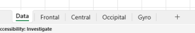

# BCIDemos

This repo includes examples of BCI - Brain-Computer Interface apps, using the BrainFlow API.

## BCIVisualizer
An app that visualizes EEG data from a Brain-Computer Interface (BCI) device.
- Uses BrainFlow Java API to extract data from a standard BCI device.
- Exports data to a MS Excel spreadsheet and creates charts by filtering selected data columns.
- Uses Apache POI library to create Excel files and charts.

### Data Sheet
All channel sample data is imported to the first sheet, in a new Excel file.
Each column is a specific channel (place on the brain, and some control data columns) and all its rows are data samples over time.
The number of rows is configuable in the app.

 

### Dynamic chart sheets
You can define an "infinite" number of charts, via a simple line of code.

Regular Expressions are used to include columns in a chart.
A chart can filter on multiple regular expressions.

<pre>
   /**
     * Configures the Excel charts to be created.
     */
    private static void configureCharts() {

        String[] titles = {"Frontal", "Central", "Occipital", "Gyro"};
        chartDescriptors = new ArrayList<>();
        chartDescriptors.add( new ChartDescriptor(titles[0], List.of("(?i)^F.*$"), false, titles[0], SAMPLE_TITLE, VALUE_TITLE, MarkerStyle.DOT));
        chartDescriptors.add( new ChartDescriptor(titles[1], List.of("(?i)^C.*$"), false, titles[1], SAMPLE_TITLE, VALUE_TITLE, MarkerStyle.DOT));
        chartDescriptors.add( new ChartDescriptor(titles[2], List.of("(?i)^O.*$", "(?i)^PO.*$", "(?i)^Pz.*$"), false, titles[2], SAMPLE_TITLE, VALUE_TITLE, MarkerStyle.DOT));
        chartDescriptors.add( new ChartDescriptor(titles[3], List.of("(?i)^Gyro.*$"), false, titles[3], SAMPLE_TITLE, VALUE_TITLE, MarkerStyle.DOT));
    }
</pre>

Here are some chart screenshots of the other sheets.

[BCIVisualizer](src/org/example/bci/visualizer/README.md)

## Developed by
Ronni Kahalani 2024.

